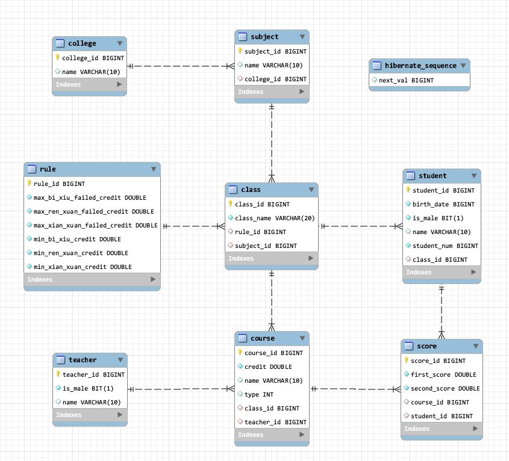
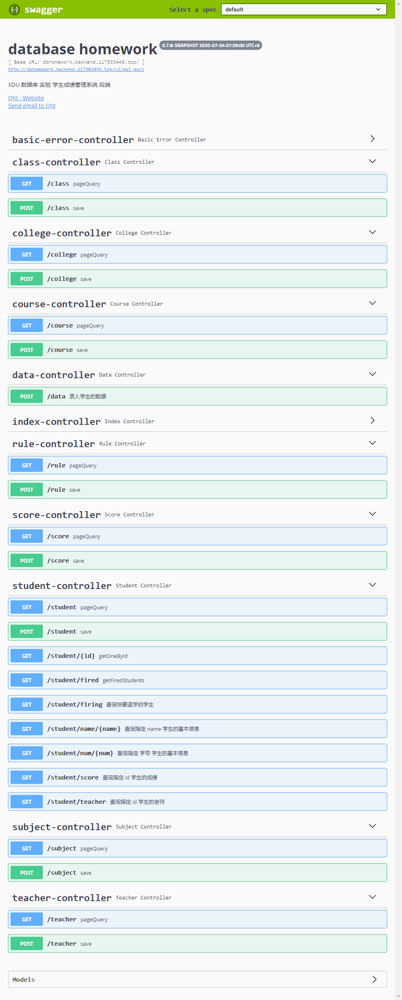

# database_homework

XDU 数据库 实验 学生成绩管理系统 后端

> 特别鸣谢 宇恺同学给予的前端技术支持 🙏

## 项目地址

前端 <https://github.com/ZYK1236/homework_Vue>

后端 <https://github.com/117503445/database_homework>

## 技术栈

Spring Boot + Hibernate

## 线上地址

前端 <http://dbhomework.117503445.top/>

后端首页 <http://dbhomework.backend.117503445.top>

Swagger 文档 <http://dbhomework.backend.117503445.top/swagger-ui.html>

~~因为偷懒所以没有申请 HTTPS 证书~~

## 部署

```sh
docker run --name databasehomework -d -e dburl="jdbc:mysql://{dbhost}:{dbport}/{dbname}" -e dbun="{username}" -e dbpd="{password}" -p 80:80 --restart=always 117503445/databasehomework:latest
```

替换 {} 中的内容,主要是和数据库有关的配置.

## 本地运行

创建 application.yml , 文件内容及路径同 application.yml.example, 替换 {} 中的内容.

## 作业需求

### 数据库语义

- 一个学院可以若干专业，每个专业每年可以招若干班，每个班有若干学生。

- 学院里对每个专业每年都制订了教学计划，学生每年必须按照教学计划修完一定学分的课程（必修课、限选课和任选课），如大三上学期必修课22学分，限选课10学分，任选课6学分。

- 教师可以给多个班带课，但是不能给一个班带多门课程。

- 一门课程最多允许学生一次补考，学生达到如下条件之一的被开除：一学期不及格的必修课学分超过10个。不及格必修课学分累计超过30个。不及格选修课学分累计超过20个。

### 前台程序

> 开发一个学籍管理系统（桌面应用或web均可）来对数据库进行访问，可以使用PowerBuilder、VC或web页面等集成开发环境。

- 录入学生基本信息，如学号、姓名、性别、出生日期等（其它如课程、教师等信息可以在建库时输入）。

- 按学号、姓名查询学生基本信息。

- 录入学生成绩。

- 查询学生所选修的课程及成绩，并给出必修课平均成绩、所有课程平均成绩。

- 查某一个学生被哪些教师教过课。

- 查询快要被开除的学生（假定差2学分即被开除）。

### 注意事项

- 在数据库的设计过程中需要运用规范化理论，避免出现插入异常、删除异常、数据冗余等问题。

- 必须设定关系的完整性规则，如实体完整性（例如设置主码），参照完整性（例如设置外码和对应的主码），用户自定义完整性（例如性别只能为“男”或“女”）。

- 可以使用索引来加快查询的速度。

- 可以使用视图来简化系统的设计。

- 上机实习重点在于后台数据库的设计，对于前台程序的开发，能够实现系统功能即可，不要把大量时间花费在界面设计和不必要的代码上。

## API接口定义

### 查询指定 学号 学生的基本信息

<http://dbhomework.backend.117503445.top/swagger-ui.html#/student-controller/getOneByNumUsingGET>

```sh
curl -X GET "http://dbhomework.backend.117503445.top/student/num/18079100004" -H "accept: */*"
```

```json
{
  "studentId": 2,
  "name": "齐浩天",
  "birthDate": 953740800,
  "className": "1818039",
  "subjectName": "网络空间安全",
  "collegeName": "网络与信息安全",
  "studentNum": 18079100004,
  "male": true
}
```

### 查询指定 name 学生的基本信息

<http://dbhomework.backend.117503445.top/swagger-ui.html#/student-controller/getOneByNameUsingGET>

```sh
curl -X GET "http://dbhomework.backend.117503445.top/student/name/齐浩天" -H "accept: */*"
```

```json
{
  "studentId": 2,
  "name": "齐浩天",
  "birthDate": 953740800,
  "className": "1818039",
  "subjectName": "网络空间安全",
  "collegeName": "网络与信息安全",
  "studentNum": 18079100004,
  "male": true
}
```

### 查询指定 id 学生的成绩

<http://dbhomework.backend.117503445.top/swagger-ui.html#/student-controller/getScoresUsingGET>

```sh
curl -X GET "http://dbhomework.backend.117503445.top/student/score?id=1" -H "accept: */*"
```

```json
[
  {
    "scoreId": 1,
    "firstScore": 100,
    "secondScore": -1,
    "courseName": "语文",
    "courseType": 0,
    "courseCredit": 10
  },
  {
    "scoreId": 2,
    "firstScore": 100,
    "secondScore": -1,
    "courseName": "数学",
    "courseType": 0,
    "courseCredit": 10
  },
  {
    "scoreId": 3,
    "firstScore": 100,
    "secondScore": -1,
    "courseName": "英语",
    "courseType": 0,
    "courseCredit": 8
  },
  {
    "scoreId": 4,
    "firstScore": 100,
    "secondScore": -1,
    "courseName": "限选",
    "courseType": 1,
    "courseCredit": 10
  },
  {
    "scoreId": 5,
    "firstScore": 100,
    "secondScore": -1,
    "courseName": "任选",
    "courseType": 2,
    "courseCredit": 6
  }
]
```

courseType 的定义:

- 0 -> 必修

- 1 -> 限选

- 2 -> 任选

### 查询指定 id 学生的老师

<http://dbhomework.backend.117503445.top/swagger-ui.html#/student-controller/getTeachersUsingGET>

```sh
curl -X GET "http://dbhomework.backend.117503445.top/student/teacher?id=1" -H "accept: */*"
```

```json
[
  {
    "courseName": "语文",
    "teacherName": "张语一"
  },
  {
    "courseName": "数学",
    "teacherName": "张数一"
  },
  {
    "courseName": "英语",
    "teacherName": "张英一"
  },
  {
    "courseName": "限选",
    "teacherName": "张限一"
  },
  {
    "courseName": "任选",
    "teacherName": "张任一"
  }
]
```

### 查询快要退学的学生

<http://dbhomework.backend.117503445.top/swagger-ui.html#/student-controller/getFiringStudentsUsingGET>

```sh
curl -X GET "http://dbhomework.backend.117503445.top/student/firing" -H "accept: */*"
```

```json
[
  {
    "studentId": 3,
    "name": "伍松",
    "birthDate": 957801600,
    "className": "1807021",
    "subjectName": "应用数学",
    "collegeName": "应用数学与统计",
    "studentNum": 18079100007,
    "male": true
  }
]
```

### 数据录入

<http://dbhomework.backend.117503445.top/swagger-ui.html#/data-controller/saveUsingPOST_3>

```sh
curl -X POST "http://dbhomework.backend.117503445.top/data" -H "accept: */*" -H "Content-Type: application/json" -d "{ \"chineseFirstScore\": 0, \"chineseSecondScore\": 0, \"chineseTeacherName\": \"语文老师名\", \"className\": \"班级名\", \"collegeName\": \"学院名\", \"englishFirstScore\": 0, \"englishSecondScore\": 0, \"englishTeacherName\": \"英语老师名\", \"mathFirstScore\": 0, \"mathSecondScore\": 0, \"mathTeacherName\": \"数学老师名\", \"renXuanFirstScore\": 0, \"renXuanSecondScore\": 0, \"renXuanTeacherName\": \"任选老师名\", \"studentBirthDate\": 0, \"studentIsMale\": true, \"studentName\": \"string\", \"studentNum\": 0, \"subjectName\": \"专业名\", \"xianXuanFirstScore\": 0, \"xianXuanSecondScore\": 0, \"xianXuanTeacherName\": \"限选老师名\"}"
```

5

返回值为 studentId

FirstScore : 正考成绩 未参加考试计为 -1
SecondScore : 补考成绩 未参加考试计为 -1


> 下列说明为本服务端的逻辑

1. 后端会根据学院名进行查找学院。如果没有找到，就会创建新的学院。不允许重名。

2. 然后根据专业名进行查找专业。如果没有找到，就会创建新的专业。不允许重名。

3. 根据教师名查找教师。如果没找到，就会创建教师。不允许重名。

4. 然后根据班级名进行查找班级。如果没有找到，就会创建新的班级，并创建对应的课程。不允许重名。

5. 然后直接创建学生数据，因此允许学生重名。

6. 然后再录入成绩。

## 数据库设计



符合 BCNF 范式，除了 score 表，都符合第四范式。（希望我没有判断错

> 建表语句

```sql
--
-- Table structure for table `class`
--

DROP TABLE IF EXISTS `class`;
/*!40101 SET @saved_cs_client     = @@character_set_client */;
/*!50503 SET character_set_client = utf8mb4 */;
CREATE TABLE `class` (
  `class_id` bigint NOT NULL AUTO_INCREMENT,
  `class_name` varchar(20) NOT NULL,
  `rule_id` bigint DEFAULT NULL,
  `subject_id` bigint DEFAULT NULL,
  PRIMARY KEY (`class_id`),
  KEY `fk_class_rule` (`rule_id`),
  KEY `fk_class_subject` (`subject_id`),
  CONSTRAINT `fk_class_rule` FOREIGN KEY (`rule_id`) REFERENCES `rule` (`rule_id`),
  CONSTRAINT `fk_class_subject` FOREIGN KEY (`subject_id`) REFERENCES `subject` (`subject_id`)
) ENGINE=InnoDB AUTO_INCREMENT=4 DEFAULT CHARSET=utf8mb4 COLLATE=utf8mb4_0900_ai_ci;
/*!40101 SET character_set_client = @saved_cs_client */;

--
-- Table structure for table `college`
--

DROP TABLE IF EXISTS `college`;
/*!40101 SET @saved_cs_client     = @@character_set_client */;
/*!50503 SET character_set_client = utf8mb4 */;
CREATE TABLE `college` (
  `college_id` bigint NOT NULL AUTO_INCREMENT,
  `name` varchar(10) DEFAULT NULL,
  PRIMARY KEY (`college_id`)
) ENGINE=InnoDB AUTO_INCREMENT=3 DEFAULT CHARSET=utf8mb4 COLLATE=utf8mb4_0900_ai_ci;
/*!40101 SET character_set_client = @saved_cs_client */;

--
-- Table structure for table `course`
--

DROP TABLE IF EXISTS `course`;
/*!40101 SET @saved_cs_client     = @@character_set_client */;
/*!50503 SET character_set_client = utf8mb4 */;
CREATE TABLE `course` (
  `course_id` bigint NOT NULL AUTO_INCREMENT,
  `credit` double NOT NULL,
  `name` varchar(10) DEFAULT NULL,
  `type` int DEFAULT NULL,
  `class_id` bigint DEFAULT NULL,
  `teacher_id` bigint DEFAULT NULL,
  PRIMARY KEY (`course_id`),
  KEY `fk_course_class` (`class_id`),
  KEY `fk_course_teacher` (`teacher_id`),
  CONSTRAINT `fk_course_class` FOREIGN KEY (`class_id`) REFERENCES `class` (`class_id`),
  CONSTRAINT `fk_course_teacher` FOREIGN KEY (`teacher_id`) REFERENCES `teacher` (`teacher_id`),
  CONSTRAINT `course_chk_1` CHECK ((`type` in (0,1,2)))
) ENGINE=InnoDB AUTO_INCREMENT=16 DEFAULT CHARSET=utf8mb4 COLLATE=utf8mb4_0900_ai_ci;
/*!40101 SET character_set_client = @saved_cs_client */;

--
-- Table structure for table `guide`
--

DROP TABLE IF EXISTS `guide`;
/*!40101 SET @saved_cs_client     = @@character_set_client */;
/*!50503 SET character_set_client = utf8mb4 */;
CREATE TABLE `guide` (
  `score_id` bigint NOT NULL AUTO_INCREMENT,
  `first_score` double NOT NULL,
  `second_score` double NOT NULL,
  `course_id` bigint DEFAULT NULL,
  `student_id` bigint DEFAULT NULL,
  PRIMARY KEY (`score_id`),
  KEY `fk_score_course` (`course_id`),
  KEY `fk_score_student` (`student_id`),
  CONSTRAINT `fk_score_course` FOREIGN KEY (`course_id`) REFERENCES `course` (`course_id`),
  CONSTRAINT `fk_score_student` FOREIGN KEY (`student_id`) REFERENCES `student` (`student_id`)
) ENGINE=InnoDB AUTO_INCREMENT=21 DEFAULT CHARSET=utf8mb4 COLLATE=utf8mb4_0900_ai_ci;
/*!40101 SET character_set_client = @saved_cs_client */;

--
-- Table structure for table `rule`
--

DROP TABLE IF EXISTS `rule`;
/*!40101 SET @saved_cs_client     = @@character_set_client */;
/*!50503 SET character_set_client = utf8mb4 */;
CREATE TABLE `rule` (
  `rule_id` bigint NOT NULL AUTO_INCREMENT,
  `max_bi_xiu_failed_credit` double NOT NULL,
  `max_ren_xuan_failed_credit` double NOT NULL,
  `max_xian_xuan_failed_credit` double NOT NULL,
  `min_bi_xiu_credit` double NOT NULL,
  `min_ren_xuan_credit` double NOT NULL,
  `min_xian_xuan_credit` double NOT NULL,
  PRIMARY KEY (`rule_id`)
) ENGINE=InnoDB AUTO_INCREMENT=2 DEFAULT CHARSET=utf8mb4 COLLATE=utf8mb4_0900_ai_ci;
/*!40101 SET character_set_client = @saved_cs_client */;

--
-- Table structure for table `student`
--

DROP TABLE IF EXISTS `student`;
/*!40101 SET @saved_cs_client     = @@character_set_client */;
/*!50503 SET character_set_client = utf8mb4 */;
CREATE TABLE `student` (
  `student_id` bigint NOT NULL AUTO_INCREMENT,
  `birth_date` bigint NOT NULL,
  `is_male` bit(1) NOT NULL,
  `name` varchar(10) DEFAULT NULL,
  `student_num` bigint NOT NULL,
  `class_id` bigint DEFAULT NULL,
  PRIMARY KEY (`student_id`),
  KEY `fk_student_class` (`class_id`),
  CONSTRAINT `fk_student_class` FOREIGN KEY (`class_id`) REFERENCES `class` (`class_id`)
) ENGINE=InnoDB AUTO_INCREMENT=5 DEFAULT CHARSET=utf8mb4 COLLATE=utf8mb4_0900_ai_ci;
/*!40101 SET character_set_client = @saved_cs_client */;

--
-- Table structure for table `subject`
--

DROP TABLE IF EXISTS `subject`;
/*!40101 SET @saved_cs_client     = @@character_set_client */;
/*!50503 SET character_set_client = utf8mb4 */;
CREATE TABLE `subject` (
  `subject_id` bigint NOT NULL AUTO_INCREMENT,
  `name` varchar(10) DEFAULT NULL,
  `college_id` bigint DEFAULT NULL,
  PRIMARY KEY (`subject_id`),
  KEY `fk_subject_college` (`college_id`),
  CONSTRAINT `fk_subject_college` FOREIGN KEY (`college_id`) REFERENCES `college` (`college_id`)
) ENGINE=InnoDB AUTO_INCREMENT=3 DEFAULT CHARSET=utf8mb4 COLLATE=utf8mb4_0900_ai_ci;
/*!40101 SET character_set_client = @saved_cs_client */;

--
-- Table structure for table `teacher`
--

DROP TABLE IF EXISTS `teacher`;
/*!40101 SET @saved_cs_client     = @@character_set_client */;
/*!50503 SET character_set_client = utf8mb4 */;
CREATE TABLE `teacher` (
  `teacher_id` bigint NOT NULL AUTO_INCREMENT,
  `is_male` bit(1) NOT NULL,
  `name` varchar(10) DEFAULT NULL,
  PRIMARY KEY (`teacher_id`)
) ENGINE=InnoDB AUTO_INCREMENT=16 DEFAULT CHARSET=utf8mb4 COLLATE=utf8mb4_0900_ai_ci;
```

> 数据导入语句

```sql
INSERT INTO `dbhomework`.`rule`(`rule_id`,`max_bi_xiu_failed_credit`,`max_ren_xuan_failed_credit`,`max_xian_xuan_failed_credit`,`min_bi_xiu_credit`,`min_ren_xuan_credit`,`min_xian_xuan_credit`) VALUES (1,10,30,20,22,10,6);

INSERT INTO `dbhomework`.`college`(`college_id`, `name`) VALUES (1, "网络与信息安全");
INSERT INTO `dbhomework`.`college`(`college_id`, `name`) VALUES (2, "应用数学与统计");

INSERT INTO `dbhomework`.`subject`(`subject_id`,`name`,`college_id`) VALUES (1,"网络空间安全",1);
INSERT INTO `dbhomework`.`subject`(`subject_id`,`name`,`college_id`) VALUES (2,"应用数学",2);

INSERT INTO `dbhomework`.`class`(`class_id`,`class_name`,`rule_id`,`subject_id`) VALUES (1,"1818039",1,"1");
INSERT INTO `dbhomework`.`class`(`class_id`,`class_name`,`rule_id`,`subject_id`) VALUES (2,"1807021",1,"2");
INSERT INTO `dbhomework`.`class`(`class_id`,`class_name`,`rule_id`,`subject_id`) VALUES (3,"1807022",1,"2");

INSERT INTO `dbhomework`.`teacher`(`teacher_id`,`is_male`,`name`) VALUES (1,true,"张语一");
INSERT INTO `dbhomework`.`teacher`(`teacher_id`,`is_male`,`name`) VALUES (2,true,"张语二");
INSERT INTO `dbhomework`.`teacher`(`teacher_id`,`is_male`,`name`) VALUES (3,true,"张语三");
INSERT INTO `dbhomework`.`teacher`(`teacher_id`,`is_male`,`name`) VALUES (4,false,"张数一");
INSERT INTO `dbhomework`.`teacher`(`teacher_id`,`is_male`,`name`) VALUES (5,true,"张数二");
INSERT INTO `dbhomework`.`teacher`(`teacher_id`,`is_male`,`name`) VALUES (6,true,"张数三");
INSERT INTO `dbhomework`.`teacher`(`teacher_id`,`is_male`,`name`) VALUES (7,true,"张英一");
INSERT INTO `dbhomework`.`teacher`(`teacher_id`,`is_male`,`name`) VALUES (8,false,"张英二");
INSERT INTO `dbhomework`.`teacher`(`teacher_id`,`is_male`,`name`) VALUES (9,false,"张英三");
INSERT INTO `dbhomework`.`teacher`(`teacher_id`,`is_male`,`name`) VALUES (10,true,"张限一");
INSERT INTO `dbhomework`.`teacher`(`teacher_id`,`is_male`,`name`) VALUES (11,true,"张限二");
INSERT INTO `dbhomework`.`teacher`(`teacher_id`,`is_male`,`name`) VALUES (12,true,"张限三");
INSERT INTO `dbhomework`.`teacher`(`teacher_id`,`is_male`,`name`) VALUES (13,false,"张任一");
INSERT INTO `dbhomework`.`teacher`(`teacher_id`,`is_male`,`name`) VALUES (14,true,"张任二");
INSERT INTO `dbhomework`.`teacher`(`teacher_id`,`is_male`,`name`) VALUES (15,true,"张任三");

INSERT INTO `dbhomework`.`student`(`student_id`,`birth_date`,`is_male`,`name`,`student_num`,`class_id`) VALUES (1,968688000,true,"张宇恺","18180100102",1);
INSERT INTO `dbhomework`.`student`(`student_id`,`birth_date`,`is_male`,`name`,`student_num`,`class_id`) VALUES (2,953740800,true,"齐浩天","18079100004",1);
INSERT INTO `dbhomework`.`student`(`student_id`,`birth_date`,`is_male`,`name`,`student_num`,`class_id`) VALUES (3,957801600,true,"伍松","18079100007",2);
INSERT INTO `dbhomework`.`student`(`student_id`,`birth_date`,`is_male`,`name`,`student_num`,`class_id`) VALUES (4,963158400,false,"陈昆","18070300011",3);


INSERT INTO `dbhomework`.`course`(`course_id`,`credit`,`name`,`type`,`class_id`,`teacher_id`) VALUES (1,10,"语文",0,1,1);
INSERT INTO `dbhomework`.`course`(`course_id`,`credit`,`name`,`type`,`class_id`,`teacher_id`) VALUES (2,10,"数学",0,1,4);
INSERT INTO `dbhomework`.`course`(`course_id`,`credit`,`name`,`type`,`class_id`,`teacher_id`) VALUES (3,8,"英语",0,1,7);
INSERT INTO `dbhomework`.`course`(`course_id`,`credit`,`name`,`type`,`class_id`,`teacher_id`) VALUES (4,10,"限选",1,1,10);
INSERT INTO `dbhomework`.`course`(`course_id`,`credit`,`name`,`type`,`class_id`,`teacher_id`) VALUES (5,6,"任选",2,1,13);

INSERT INTO `dbhomework`.`course`(`course_id`,`credit`,`name`,`type`,`class_id`,`teacher_id`) VALUES (6,10,"语文",0,2,2);
INSERT INTO `dbhomework`.`course`(`course_id`,`credit`,`name`,`type`,`class_id`,`teacher_id`) VALUES (7,10,"数学",0,2,5);
INSERT INTO `dbhomework`.`course`(`course_id`,`credit`,`name`,`type`,`class_id`,`teacher_id`) VALUES (8,8,"英语",0,2,8);
INSERT INTO `dbhomework`.`course`(`course_id`,`credit`,`name`,`type`,`class_id`,`teacher_id`) VALUES (9,10,"限选",1,2,11);
INSERT INTO `dbhomework`.`course`(`course_id`,`credit`,`name`,`type`,`class_id`,`teacher_id`) VALUES (10,6,"任选",2,2,14);

INSERT INTO `dbhomework`.`course`(`course_id`,`credit`,`name`,`type`,`class_id`,`teacher_id`) VALUES (11,10,"语文",0,3,3);
INSERT INTO `dbhomework`.`course`(`course_id`,`credit`,`name`,`type`,`class_id`,`teacher_id`) VALUES (12,10,"数学",0,3,6);
INSERT INTO `dbhomework`.`course`(`course_id`,`credit`,`name`,`type`,`class_id`,`teacher_id`) VALUES (13,8,"英语",0,3,9);
INSERT INTO `dbhomework`.`course`(`course_id`,`credit`,`name`,`type`,`class_id`,`teacher_id`) VALUES (14,10,"限选",1,3,12);
INSERT INTO `dbhomework`.`course`(`course_id`,`credit`,`name`,`type`,`class_id`,`teacher_id`) VALUES (15,6,"任选",2,3,15);


INSERT INTO `dbhomework`.`score`(`score_id`,`first_score`,`second_score`,`course_id`,`student_id`) VALUES (1,100,-1,1,1);
INSERT INTO `dbhomework`.`score`(`score_id`,`first_score`,`second_score`,`course_id`,`student_id`) VALUES (2,100,-1,2,1);
INSERT INTO `dbhomework`.`score`(`score_id`,`first_score`,`second_score`,`course_id`,`student_id`) VALUES (3,100,-1,3,1);
INSERT INTO `dbhomework`.`score`(`score_id`,`first_score`,`second_score`,`course_id`,`student_id`) VALUES (4,100,-1,4,1);
INSERT INTO `dbhomework`.`score`(`score_id`,`first_score`,`second_score`,`course_id`,`student_id`) VALUES (5,100,-1,5,1);

INSERT INTO `dbhomework`.`score`(`score_id`,`first_score`,`second_score`,`course_id`,`student_id`) VALUES (6,100,-1,1,2);
INSERT INTO `dbhomework`.`score`(`score_id`,`first_score`,`second_score`,`course_id`,`student_id`) VALUES (7,100,-1,2,2);
INSERT INTO `dbhomework`.`score`(`score_id`,`first_score`,`second_score`,`course_id`,`student_id`) VALUES (8,100,-1,3,2);
INSERT INTO `dbhomework`.`score`(`score_id`,`first_score`,`second_score`,`course_id`,`student_id`) VALUES (9,100,-1,4,2);
INSERT INTO `dbhomework`.`score`(`score_id`,`first_score`,`second_score`,`course_id`,`student_id`) VALUES (10,100,-1,5,2);

INSERT INTO `dbhomework`.`score`(`score_id`,`first_score`,`second_score`,`course_id`,`student_id`) VALUES (11,100,-1,6,3);
INSERT INTO `dbhomework`.`score`(`score_id`,`first_score`,`second_score`,`course_id`,`student_id`) VALUES (12,100,-1,7,3);
INSERT INTO `dbhomework`.`score`(`score_id`,`first_score`,`second_score`,`course_id`,`student_id`) VALUES (13,59,59,8,3);
INSERT INTO `dbhomework`.`score`(`score_id`,`first_score`,`second_score`,`course_id`,`student_id`) VALUES (14,100,-1,9,3);
INSERT INTO `dbhomework`.`score`(`score_id`,`first_score`,`second_score`,`course_id`,`student_id`) VALUES (15,100,-1,10,3);

INSERT INTO `dbhomework`.`score`(`score_id`,`first_score`,`second_score`,`course_id`,`student_id`) VALUES (16,100,-1,11,4);
INSERT INTO `dbhomework`.`score`(`score_id`,`first_score`,`second_score`,`course_id`,`student_id`) VALUES (17,59,59,12,4);
INSERT INTO `dbhomework`.`score`(`score_id`,`first_score`,`second_score`,`course_id`,`student_id`) VALUES (18,100,-1,13,4);
INSERT INTO `dbhomework`.`score`(`score_id`,`first_score`,`second_score`,`course_id`,`student_id`) VALUES (19,100,-1,14,4);
INSERT INTO `dbhomework`.`score`(`score_id`,`first_score`,`second_score`,`course_id`,`student_id`) VALUES (20,100,-1,15,4);
```

## 项目展示


